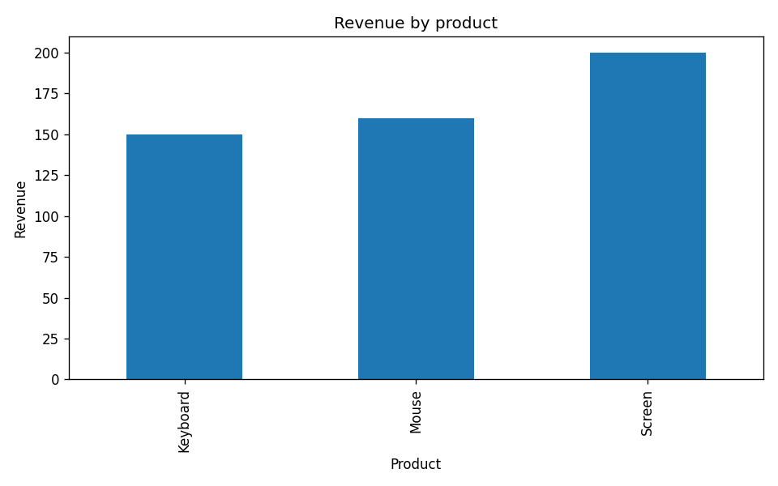

# Sales Analysis Project

## Project Overview
This project analyzes a small sales dataset using Python and Pandas.
The goal is to demonstrate core Data Analyst skills:
data loading, data transformation, and exploratory analysis.

## Dataset
The dataset contains sales transactions with:
- date of sale
- product name
- quantity sold
- unit price

## Key Analyses
- Total revenue and total quantity sold
- Revenue and quantity by product
- Daily revenue trends

## Tools Used
- Python
- Pandas
## Visualization

Revenue by product:

## Key Skills Demonstrated
- Data cleaning and feature engineering
- Vectorized operations
- GroupBy aggregations
- KPI calculation

